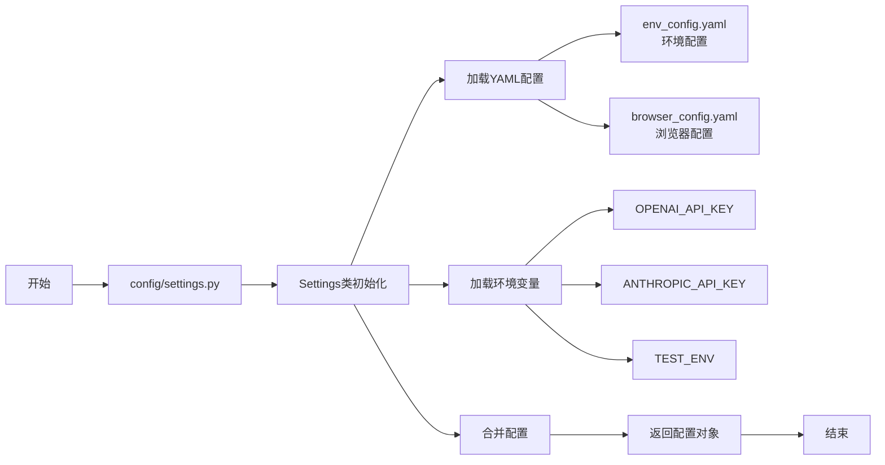
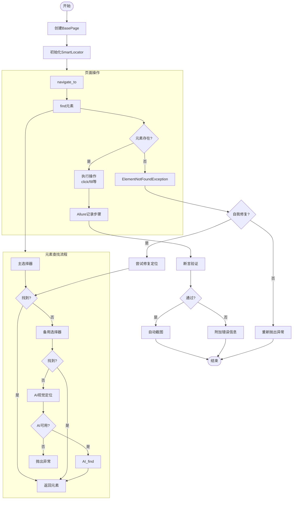
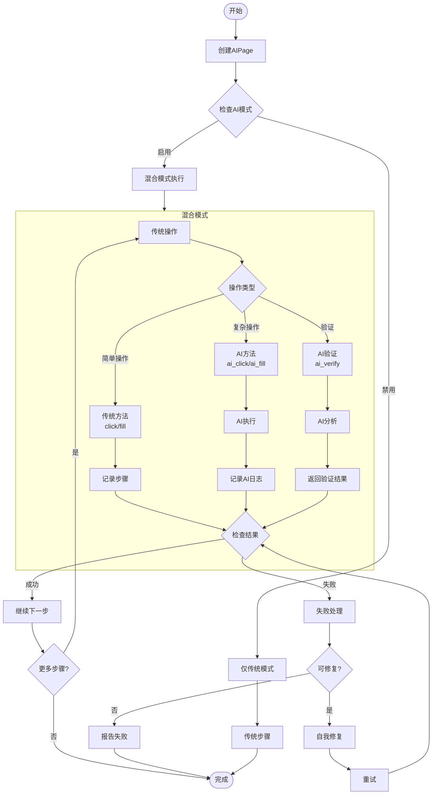
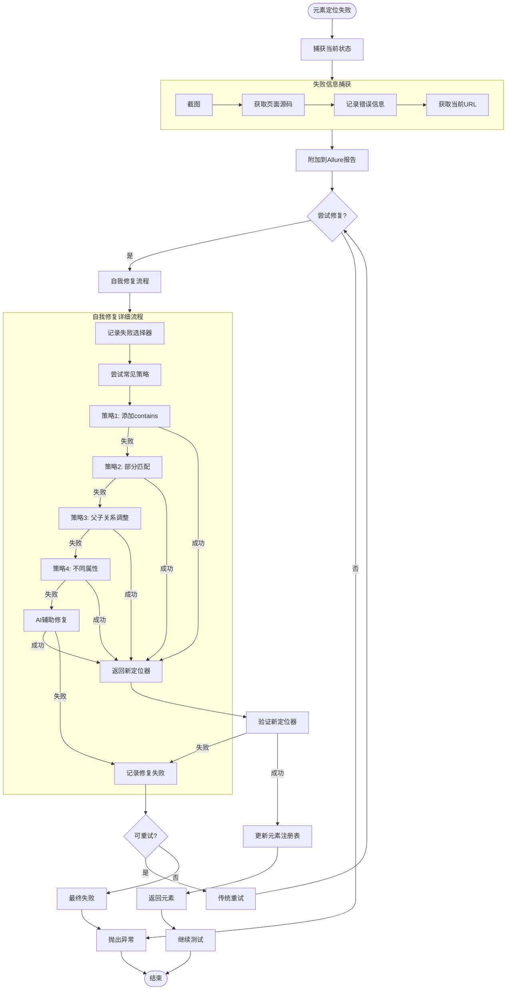
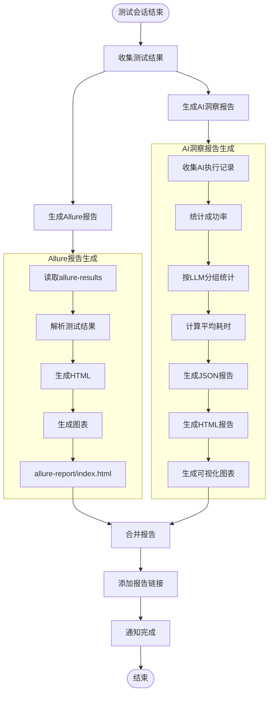
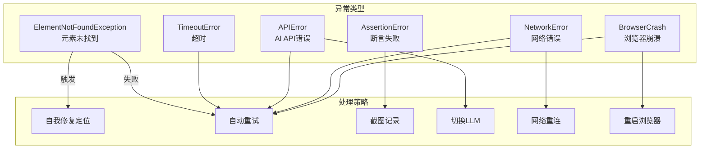
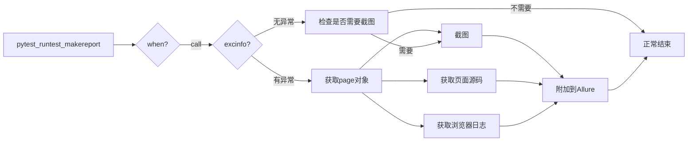
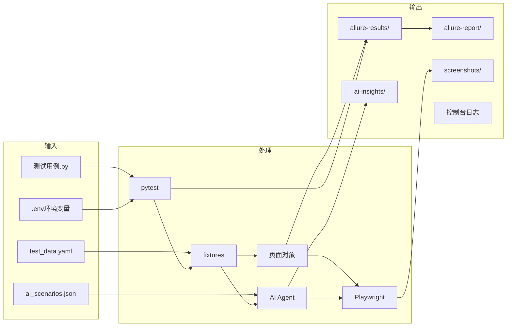
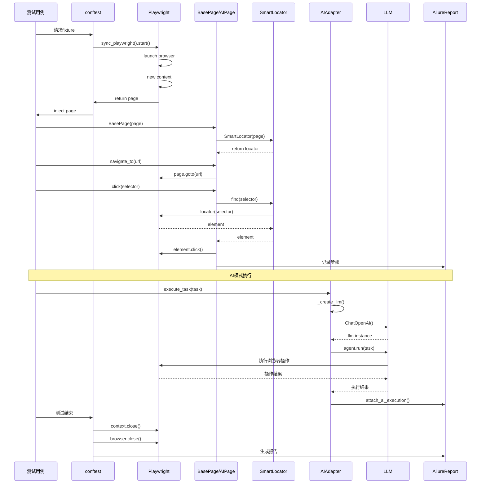

# Playwright AI 框架 - 测试执行流程图

本文档详细描述了框架执行测试用例的完整流程，包括正常执行路径和异常处理路径。

---

## 一、整体执行流程概览

```mermaid
flowchart TB
    Start([开始]) --> LoadConfig[加载配置]
    LoadConfig --> |读取| settings.py
    LoadConfig --> |读取| env_config.yaml
    LoadConfig --> |读取| browser_config.yaml
    LoadConfig --> |加载|.env环境变量
    
    LoadConfig --> InitPytest[初始化pytest]
    InitPytest --> DiscoverTests[发现测试用例]
    DiscoverTests --> CheckMarker{检查Marker}
    
    CheckMarker -->|@pytest.mark.ai| AITest[AI驱动测试流程]
    CheckMarker -->|@pytest.mark.hybrid| HybridTest[混合测试流程]
    CheckMarker -->|无特殊Marker| TraditionalTest[传统测试流程]
    
    TraditionalTest --> SetupFixture[执行fixture:setUp]
    AITest --> SetupAIFixture[执行fixture:ai_agent]
    HybridTest --> SetupHybridFixture[执行fixture:smart_page]
    
    SetupFixture --> RunTest[执行测试方法]
    SetupAIFixture --> RunAITest[执行AI测试方法]
    SetupHybridFixture --> RunHybridTest[执行混合测试方法]
    
    RunTest --> CheckResult{检查测试结果}
    RunAITest --> CheckResult
    RunHybridTest --> CheckResult
    
    CheckResult -->|成功| SuccessFlow[成功处理流程]
    CheckResult -->|失败| FailureFlow[失败处理流程]
    CheckResult -->|错误| ErrorFlow[错误处理流程]
    
    SuccessFlow --> CollectEvidence[收集测试证据]
    FailureFlow --> AutoRetry{自动重试?}
    ErrorFlow --> AutoRetry
    
    AutoRetry -->|是| RetryTest[重试测试]
    AutoRetry -->|否| CollectEvidence
    RetryTest --> CheckResult
    
    CollectEvidence --> GenerateReport[生成测试报告]
    GenerateReport --> AllureReport[Allure报告]
    GenerateReport --> AIInsights[AI洞察报告]
    
    AllureReport --> End([结束])
    AIInsights --> End
```

---

## 二、详细流程说明

### 2.1 配置加载阶段



**调用模块及作用：**

| 模块 | 文件 | 作用 |
|------|------|------|
| Settings | `config/settings.py` | 统一管理框架配置，支持多环境 |
| load_yaml | `config/settings.py:12` | 读取YAML配置文件 |
| get_env_config | `config/settings.py:25` | 获取当前环境的配置 |
| get_browser_config | `config/settings.py:31` | 获取浏览器配置 |

---

### 2.2 Fixture初始化流程

```mermaid
flowchart TB
    subgraph Traditional[传统测试Fixture]
        T1[page fixture] --> T2[sync_playwright]
        T2 --> T3[launch browser]
        T3 --> T4[new context]
        T4 --> T5[new page]
        T5 --> T6[返回page对象]
        T6 --> T7[测试执行]
        T7 --> T8[测试结束]
        T8 --> T9[context.close]
        T9 --> T10[browser.close]
    end
    
    subgraph AI[AI测试Fixture]
        A1[ai_agent fixture] --> A2{检查@ai marker}
        A2 -->|有marker| A3[创建AIAgentAdapter]
        A2 -->|无marker| A4[返回None]
        A3 --> A5[初始化Browser]
        A5 --> A6[创建LLM实例]
        A6 --> A7[返回adapter]
        A7 --> A8[测试执行]
        A8 --> A9[adapter.close]
    end
    
    subgraph Hybrid[混合测试Fixture]
        H1[smart_page fixture] --> H2[获取page]
        H2 --> H3[获取ai_agent]
        H3 --> H4[创建AIPage]
        H4 --> H5[注入page+ai_adapter]
        H5 --> H6[返回smart_page]
    end
```

**调用模块及作用：**

| Fixture | 文件 | 作用 | 生命周期 |
|---------|------|------|----------|
| page | `tests/conftest.py:35` | 提供Playwright页面实例 | function |
| async_page | `tests/conftest.py:88` | 提供异步Playwright页面 | function |
| ai_agent | `tests/conftest.py:56` | 提供AI Agent适配器 | function |
| async_ai_agent | `tests/conftest.py:103` | 提供异步AI适配器 | function |
| smart_page | `tests/conftest.py:78` | 提供AI增强页面对象 | function |
| base_page | `tests/conftest.py:83` | 提供基础页面对象 | function |

---

### 2.3 传统测试执行流程



**核心类说明：**

| 类/方法 | 文件 | 作用 |
|---------|------|------|
| BasePage | `pages/base_page.py` | 基础页面对象，封装常用操作 |
| SmartLocator.find | `core/elements/smart_locator.py:25` | 智能元素查找 |
| SelfHealingLocator | `core/elements/self_healing.py` | 自我修复定位 |
| AllureHelper | `core/reporting/allure_helper.py` | Allure报告辅助 |

---

### 2.4 AI测试执行流程

```mermaid
flowchart TB
    Start([开始]) --> CheckMarker{检查@ai marker}
    CheckMarker -->|有| CreateAdapter[创建AIAgentAdapter]
    CheckMarker -->|无| SkipAI[跳过AI初始化]
    
    CreateAdapter --> SelectLLM{选择LLM提供商}
    SelectLLM -->|openai| OpenAI[ChatOpenAI]
    SelectLLM -->|anthropic| Anthropic[ChatAnthropic]
    SelectLLM -->|local| Ollama[ChatOllama]
    
    OpenAI --> CheckKey{检查API Key}
    Anthropic --> CheckKey
    Ollama --> CheckConnection{检查连接}
    
    CheckKey -->|缺失| Error1[抛出ValueError]
    CheckKey -->|存在| InitBrowser[初始化Browser]
    CheckConnection -->|失败| Error2[连接错误]
    CheckConnection -->|成功| InitBrowser
    
    InitBrowser --> CreateAgent[创建Agent]
    CreateAgent --> ExecuteTask[execute_task]
    
    subgraph TaskExecution[任务执行流程]
        TE1[接收自然语言任务] --> TE2[构建完整提示词]
        TE2 --> TE3[调用LLM]
        TE3 --> TE4{执行成功?}
        TE4 -->|是| TE5[返回结果]
        TE4 -->|否| TE6[错误处理]
        TE6 --> TE7[重试?]
        TE7 -->|是| TE3
        TE7 -->|否| TE8[记录失败]
    end
    
    ExecuteTask --> TaskExecution
    TE5 --> RecordResult[记录执行结果]
    TE8 --> RecordResult
    
    RecordResult --> AttachAllure[附加到Allure报告]
    AttachAllure --> AIReport[记录到AI洞察报告]
    
    AIReport --> Verify{验证结果}
    Verify -->|成功| Success([成功])
    Verify -->|失败| Failure([失败])
    
    Error1 --> EndError([异常结束])
    Error2 --> EndError
    SkipAI --> NormalTest[执行传统测试]
    NormalTest --> EndNormal([结束])
```

**调用模块及作用：**

| 模块 | 文件 | 作用 |
|------|------|------|
| AIAgentAdapter | `core/driver/browser_use_adapter.py` | AI Agent适配器主类 |
| _create_llm | `core/driver/browser_use_adapter.py:38` | 创建LLM实例 |
| execute_task | `core/driver/browser_use_adapter.py:68` | 执行自然语言任务 |
| AgentFactory | `core/ai/agent_factory.py` | LLM工厂模式 |
| PromptTemplates | `core/ai/prompt_templates.py` | 提示词模板 |

---

### 2.5 混合测试执行流程



**混合模式优势：**
- 稳定流程用传统方式（快速可靠）
- 易变流程用AI方式（自适应）
- 复杂验证用AI方式（智能判断）

---

### 2.6 失败处理与自我修复流程



**自我修复策略：**

| 策略 | 方法 | 说明 |
|------|------|------|
| 添加contains | `_strategy_add_contains` | 使用CSS :has和*=匹配 |
| 部分匹配 | `_strategy_partial_match` | 使用属性*=代替= |
| 父子关系调整 | `_strategy_parent_child_swap` | 调整>和:has(>) |
| 不同属性 | `_strategy_different_attribute` | 尝试data-testid等替代 |
| AI辅助 | `_ai_healing` | 截图AI分析寻找元素 |

---

### 2.7 报告生成流程



**报告内容：**

| 报告类型 | 文件 | 内容 |
|----------|------|------|
| Allure HTML | `reports/allure-report/index.html` | 测试用例详情、趋势图、环境信息 |
| Allure Results | `reports/allure-results/*.json` | 原始测试结果数据 |
| AI Insights JSON | `reports/ai-insights/ai-insights-report.json` | AI执行统计数据 |
| AI Insights HTML | `reports/ai-insights/ai-insights-report.html` | AI执行可视化报告 |

---

## 三、异常处理流程

### 3.1 常见异常及处理



### 3.2 pytest hook异常处理



---

## 四、关键调用链

### 4.1 传统测试调用链

```
test_login.py::TestLogin::test_successful_login
├── conftest.py::page(fixture)
│   └── sync_playwright().start()
│       └── chromium.launch()
│           └── new_context()
│               └── new_page()
│                   └── YIELD page
├── pages/base_page.py::BasePage.__init__(page)
│   └── core/elements/smart_locator.py::SmartLocator.__init__()
├── BasePage.navigate_to(url)
│   └── page.goto(url)
├── BasePage.fill(selector, value)
│   ├── SmartLocator.find(selector)
│   │   ├── page.locator(selector)
│   │   └── locator.wait_for()
│   └── element.fill(value)
├── BasePage.click(selector)
│   └── SmartLocator.find(selector)
│       └── element.click()
└── conftest.py::page(fixture teardown)
    ├── screenshot (if failed)
    ├── context.close()
    └── browser.close()
```

### 4.2 AI测试调用链

```
test_natural_language.py::TestNaturalLanguage::test_shopping
├── conftest.py::async_ai_agent(fixture)
│   └── Check @ai marker
│       └── AIAgentAdapter.__init__(llm_provider="openai")
│           ├── _create_llm("openai")
│           │   └── ChatOpenAI(model="gpt-4o")
│           └── Browser(headless=False)
│               └── YIELD adapter
├── core/driver/browser_use_adapter.py::execute_task(task)
│   ├── PromptTemplates.format_base_task(task)
│   └── Agent(task=task, llm=self.llm, browser=self.browser)
│       └── agent.run()
│           ├── LLM分析任务
│           ├── 执行浏览器操作
│           └── 返回结果
├── core/reporting/allure_helper.py::attach_ai_execution()
│   └── allure.attach(result)
└── conftest.py::async_ai_agent(fixture teardown)
    └── adapter.close()
        └── browser.close()
```

### 4.3 混合测试调用链

```
test_e2e_with_ai.py::TestE2EWithAI::test_login_then_ai
├── conftest.py::async_smart_page(fixture)
│   └── AIPage(page, ai_adapter)
│       ├── BasePage.__init__(page)
│       └── YIELD smart_page
├── AIPage.navigate_to(url) [传统]
│   └── page.goto(url)
├── AIPage.ai_fill_form(form_data) [AI]
│   ├── check _smart_mode
│   ├── PromptTemplates.format_form_filling()
│   └── AIAgentAdapter.execute_task()
│       └── Agent.run()
├── AIPage.ai_verify(expectation) [AI验证]
│   └── execute_task(f"验证: {expectation}")
│       └── 返回success
└── 断言结果
```

---

## 五、数据流向图



---

## 六、时序图

### 6.1 完整测试执行时序



---

## 七、总结

本框架的执行流程具有以下特点：

1. **分层设计**：配置层 → Fixture层 → 页面层 → 测试层
2. **双模式支持**：传统模式稳定快速，AI模式智能自适应
3. **自我修复**：元素变化时自动修复，提高测试稳定性
4. **丰富报告**：Allure专业报告 + AI洞察报告双重保障
5. **完善的异常处理**：多层级重试和恢复机制

**关键设计决策：**
- 使用pytest fixture管理资源生命周期
- 页面对象模式分离业务逻辑和测试代码
- AI作为增强而非替代，保留传统测试的优势
- 自愈机制降低维护成本
